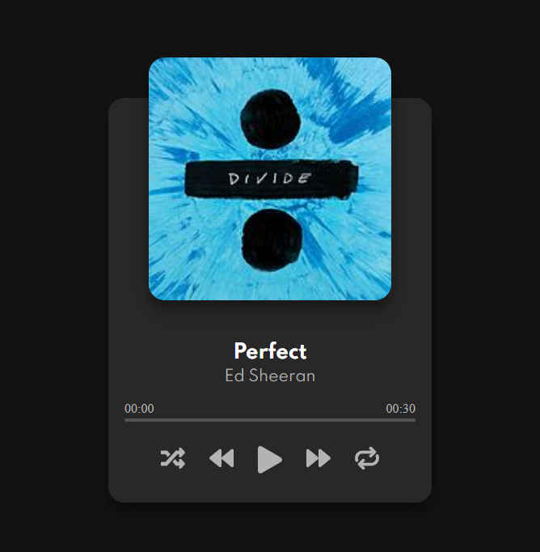

# Music Player 🎵

Play the top songs from this [digital music provider](https://us.napster.com/)
with a style inspired from [spotify](https://www.spotify.com/pe/).

# Motivation

This idea came out from [JavaScript Web Projects: 20 Projects to Build Your Portfolio](https://academy.zerotomastery.io/p/javascript-projects)

Project 8/20

# Screenshot

 

# Features

* Play or pause song
* Go to next or previous song
* Shuffle and repeat songs
* Fetch top songs from this [api](https://us.napster.com/)

# Tools

* [React](https://en.reactjs.org/) - User Interface Library 
* [Styled Components](https://styled-components.com/) - CSS in JS
* [Fontawesome](https://fontawesome.com/) - Icons
* [Music provider](https://us.napster.com/) - Api to get songs
* [Axios](https://github.com/axios/axioshttps://github.com/axios/axios) - For HTTP requests

# Deployment

[Vercel](https://music-player-azure.vercel.app/) 


# To run this app
1. Clone this repo
2. Run ```npm install```
3. Run ```npm start```

